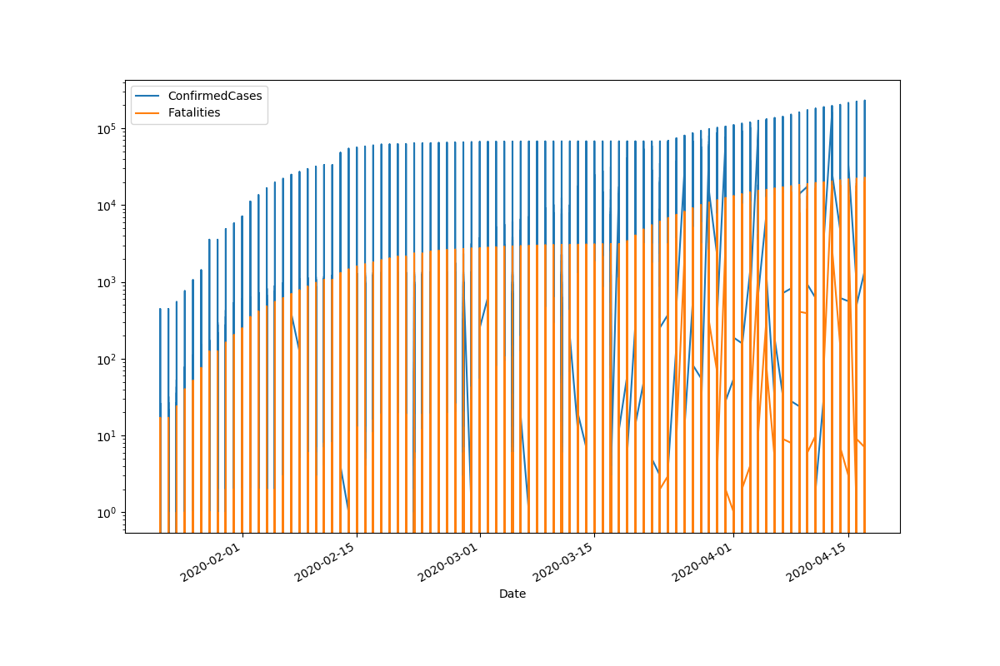
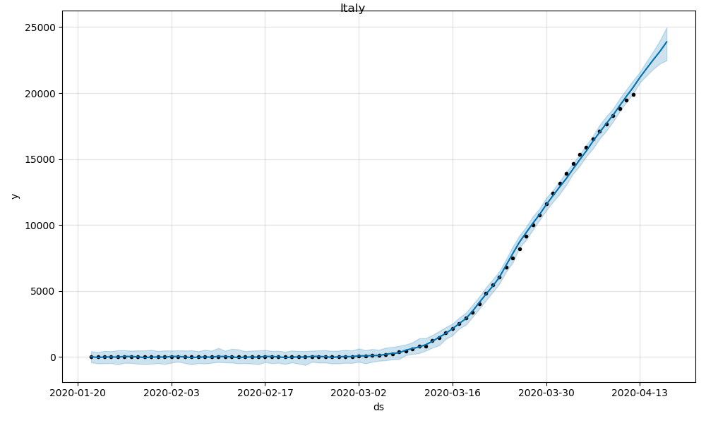

# COVID-19

### DataSet Link:

https://raw.githubusercontent.com/bitprj/covid19/master/covid_data.csv

### Total Confirmed and Fatalities cases

### Top 10 HotSpots of COVID-19 Cases

### Bar plot of Death rate vs Countries

## Prophet Model Training
Canada Mean Absolute Percentage Error: 1.6465212806555087

Italy Mean Absolute Percentage Error: 3.3752338782065414

Original Work From:
- bitproject.org